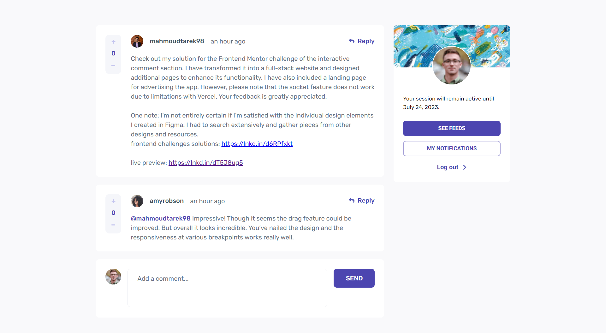

# Frontend Mentor - Interactive comments section solution

This is a solution to the [Interactive comments section challenge on Frontend Mentor](https://www.frontendmentor.io/challenges/interactive-comments-section-iG1RugEG9). Frontend Mentor challenges help you improve your coding skills by building realistic projects.

## Table of contents

- [Overview](#overview)
  - [The challenge](#the-challenge)
  - [Screenshot](#screenshot)
  - [Links](#links)
- [My process](#my-process)
  - [Built with](#built-with)
  - [What I learned](#what-i-learned)
  - [Continued development](#continued-development)
- [Author](#author)

## Overview

### The challenge

Users should be able to:

- View the optimal layout for the app depending on their device's screen size
- See hover states for all interactive elements on the page
- Create, Read, Update, and Delete comments and replies
- Upvote and downvote comments
- **Bonus**: If you're building a purely front-end project, use `localStorage` to save the current state in the browser that persists when the browser is refreshed.
- **Bonus**: Instead of using the `createdAt` strings from the `data.json` file, try using timestamps and dynamically track the time since the comment or reply was posted.

### Screenshot



### Links

- Solution URL: [Solution](https://github.com/mahmoudAcm/frontend-mentor/tree/master/interactive-comments-section)
- Live Site URL: [Live Site](https://mahmoudacm.github.io/frontend-mentor/interactive-comments-section/dist/)

## My process

### Built with

- ReactJs
- Tailwind
- Mobile-first workflow

### What I learned

I learned how to add a plugin to the `postcss.config.js` config file

if you want to use these plugins:

- tailwindcss
- autoprefixer
- postcss-media-minmax

```
yarn add tailwindcss autoprefixer postcss-media-minmax -D
```

and add them to the plugin object like the code below

```json
module.exports = {
  plugins: {
    tailwindcss: {},
    autoprefixer: {},
    "postcss-media-minmax": {},
  },
};
```

### Continued development

Use this section to outline areas that you want to continue focusing on in future projects. These could be concepts you're still not completely comfortable with or techniques you found useful that you want to refine and perfect.

**Note: Delete this note and the content within this section and replace with your own plans for continued development.**

## Author

- Website - [Mahmoud Tarek](https://portfolio-mahmoudtarek-bldai.vercel.app/)
- Frontend Mentor - [@mahmoudAcm](https://www.frontendmentor.io/profile/mahmoudAcm)
- Twitter - [@Mahmoud03066050](https://twitter.com/Mahmoud03066050)
