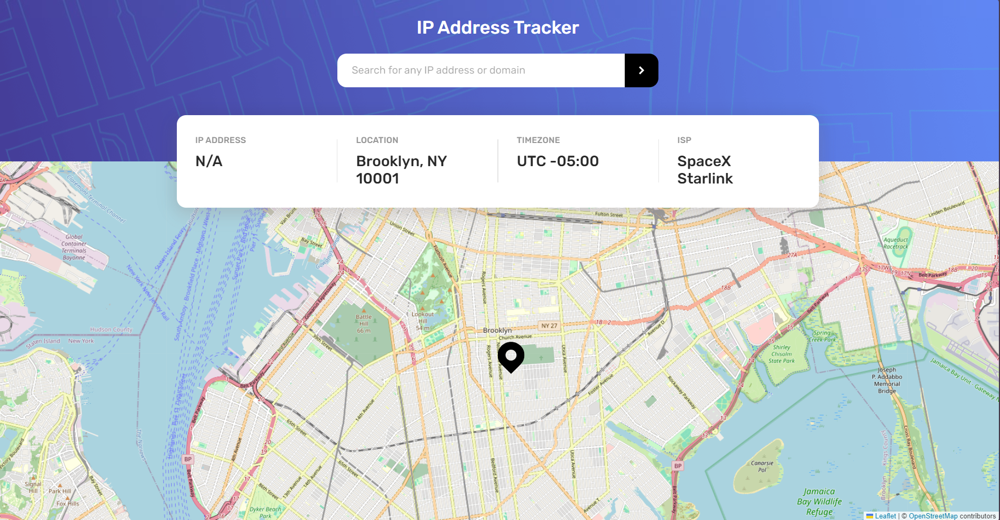

# Frontend Mentor - IP address tracker solution

This is a solution to the [IP address tracker challenge on Frontend Mentor](https://www.frontendmentor.io/challenges/ip-address-tracker-I8-0yYAH0). Frontend Mentor challenges help you improve your coding skills by building realistic projects. 

## Table of contents

- [Overview](#overview)
  - [The challenge](#the-challenge)
  - [Screenshot](#screenshot)
  - [Links](#links)
- [My process](#my-process)
  - [Built with](#built-with)
- [Author](#author)

## Overview

### The challenge

Users should be able to:

- View the optimal layout for each page depending on their device's screen size
- See hover states for all interactive elements on the page
- See their own IP address on the map on the initial page load
- Search for any IP addresses or domains and see the key information and location

### Screenshot

### Links

- Solution URL: [Solution](https://github.com/mahmoudAcm/frontend-mentor/tree/master/ip-address-tracker)
- Live Site URL: [Live Site](https://mahmoudacm.github.io/frontend-mentor/ip-address-tracker/dist)

## My process

### Built with

- Semantic HTML5 markup
- CSS custom properties
- Flexbox
- CSS Grid
- Mobile-first workflow
- [React](https://reactjs.org/) - JS library
- [Ipify](https://geo.ipify.org/) - IP Geolocation API
- [LeafletJS](https://leafletjs.com/) - For generating maps
- [Material UI](https://mui.com/) - For styles

## Author

- Website - [Mahmoud Tarek](https://portfolio-mahmoudtarek-bldai.vercel.app/)
- Frontend Mentor - [@mahmoudAcm](https://www.frontendmentor.io/profile/mahmoudAcm)
- Twitter - [@Mahmoud03066050](https://twitter.com/Mahmoud03066050)
