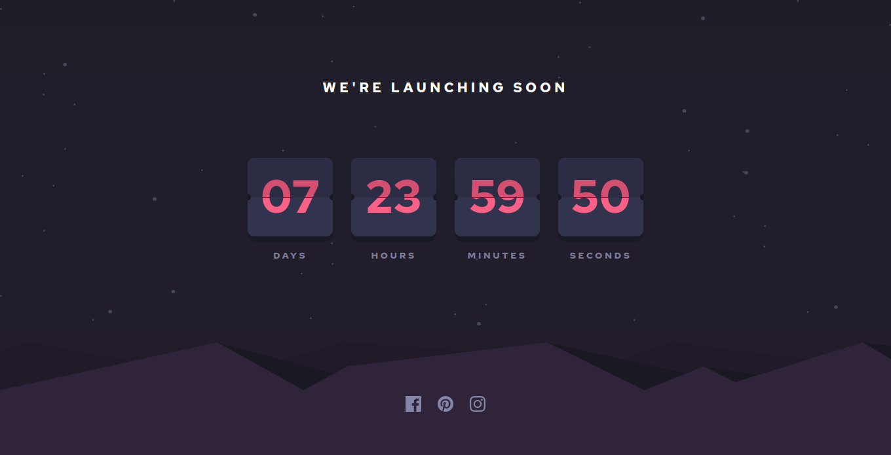

# Frontend Mentor - Launch countdown timer solution

This is a solution to the [Launch countdown timer challenge on Frontend Mentor](https://www.frontendmentor.io/challenges/launch-countdown-timer-N0XkGfyz-). Frontend Mentor challenges help you improve your coding skills by building realistic projects.

## Table of contents

- [Overview](#overview)
  - [The challenge](#the-challenge)
  - [Screenshot](#screenshot)
  - [Links](#links)
  - [Built with](#built-with)
  - [Continued development](#continued-development)
- [Author](#author)

## Overview

### The challenge

Users should be able to:

- See hover states for all interactive elements on the page
- See a live countdown timer that ticks down every second (start the count at 14 days)
- **Bonus**: When a number changes, make the card flip from the middle

### Screenshot

### Links

- Solution URL: [Solution](https://github.com/mahmoudAcm/frontend-mentor/tree/master/launch-countdown-timer)
- Live Site URL: [Live Site](https://mahmoudacm.github.io/frontend-mentor/launch-countdown-timer)

## My process

### Built with

- Semantic HTML5 markup
- CSS custom properties
- Flexbox
- CSS Grid
- Mobile-first workflow
- JavaScript

### Continued development

I will try to add flip effect and try to make this project pixel prefect.

## Author

- Website - [Mahmoud Tarek](https://portfolio-mahmoudtarek-bldai.vercel.app/)
- Frontend Mentor - [@mahmoudAcm](https://www.frontendmentor.io/profile/mahmoudAcm)
- Twitter - [@Mahmoud03066050](https://twitter.com/Mahmoud03066050)
