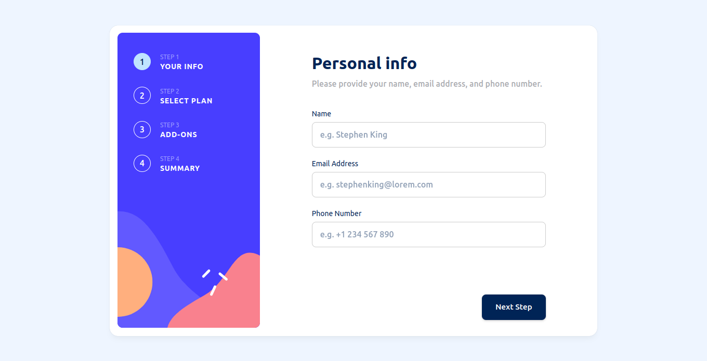

# Frontend Mentor - Multi-step form solution

This is a solution to the [Multi-step form challenge on Frontend Mentor](https://www.frontendmentor.io/challenges/multistep-form-YVAnSdqQBJ). Frontend Mentor challenges help you improve your coding skills by building realistic projects. 

## Table of contents

- [Overview](#overview)
  - [The challenge](#the-challenge)
  - [Screenshot](#screenshot)
  - [Links](#links)
- [My process](#my-process)
  - [Built with](#built-with)
  - [Continued development](#continued-development)
- [Author](#author)
## Overview

### The challenge

Users should be able to:

- Complete each step of the sequence
- See a summary of their selections on the final step and confirm their order
- View the optimal layout for the interface depending on their device's screen size
- See hover and focus states for all interactive elements on the page

### Screenshot

### Links

- Solution URL: [Solution](https://github.com/mahmoudAcm/frontend-mentor/tree/master/multi-step-form)
- Live Site URL: [Live Site](https://mahmoudacm.github.io/frontend-mentor/multi-step-form/dist)

## My process

### Built with

- Semantic HTML5 markup
- CSS custom properties
- Flexbox
- CSS Grid
- Mobile-first workflow
- [React](https://reactjs.org/) - JS library
- [Material UI](https://mui.com/) - For styles
- [Yup](https://www.npmjs.com/package/yup) - For validation

### Continued development

I will try to improve my project structure

## Author

- Website - [Mahmoud Tarek](https://portfolio-mahmoudtarek-bldai.vercel.app/)
- Frontend Mentor - [@mahmoudAcm](https://www.frontendmentor.io/profile/mahmoudAcm)
- Twitter - [@Mahmoud03066050](https://twitter.com/Mahmoud03066050)